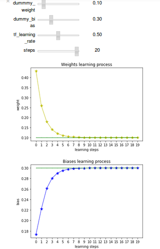

# tensorflow 2 dimensions to a line

[Sample tensorflow script](tensorflow2DimsToALine.py) 
taken from [tensorflow intro](https://www.tensorflow.org/versions/r0.10/get_started/index.html#introduction) for
[Tensorflow Virtualenv PyCharm](http://www.lotharschulz.info/2016/08/01/tensorflow-virtualenv-pycharm/) blog post 
on [lotharschulz.info](http://www.lotharschulz.info).

[Visualization](2dims2ALine_Vis_Jupyter_Matplot.png)
([tensorflow2DimsToALine.ipynb](https://github.com/lotharschulz/tensorflow2DimsToALine/blob/master/tensorflow2DimsToALine.ipynb)) 
of weights and biases is performed using 
[jupyter notebook](http://jupyter.org/) 
and [matplotlib](http://matplotlib.org).

Sliders (jupyter notebook widgets) as above in the screenshot are only visible if
jupyter notebook viewer runs with jupyter nbextension enabled.  